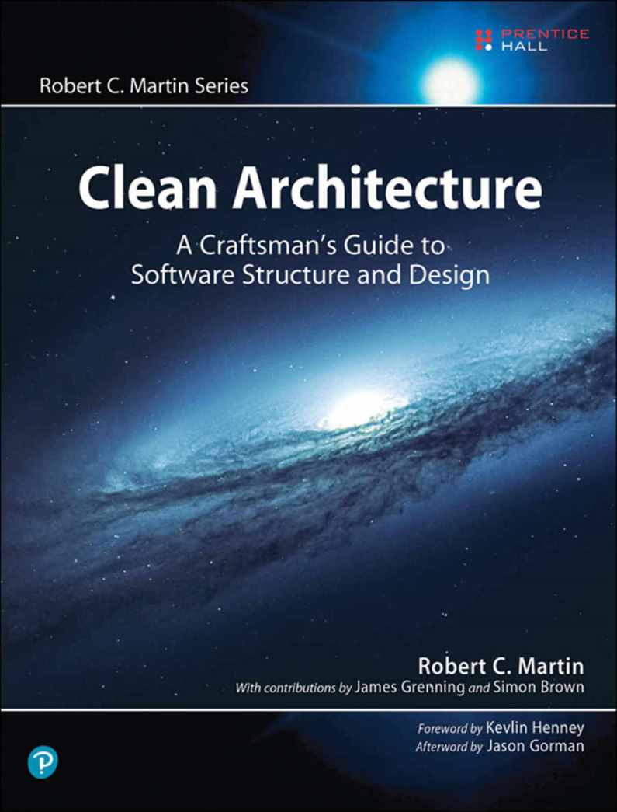

# Clean Architecture

    
    

    
<i>A Craftsman's Guide to Software Structure and Design</i>

    
Robert C. Martin

    

[TOC]

# ChatGPT's summary

**Published:** 2017

**Genre:** Software Design / Architecture / Programming Best Practices

**Core Idea:** *Good architecture enables change.* It should make the system easy to understand, develop, and maintain—**now and in the future**.

---

### ✅ **Main Premise:**

Software architecture isn’t about specific frameworks or tools—it's about **how components are organized** and **how dependencies are managed**. Uncle Bob introduces principles that allow software systems to be **flexible, maintainable, testable, and independent of frameworks, UI, databases, and external systems**.

---

## 🧱 **Core Concepts & Lessons**

### 1. **The Goal of Architecture**

* The primary purpose of software architecture is to **enable change**.
* A good architecture allows you to delay decisions about frameworks, databases, and other details.
* It maximizes the lifespan of the software.

---

### 2. **Separation of Concerns**

* Keep **business rules (logic)** separate from:

  * UI frameworks
  * Databases
  * External systems (like web services or file systems)
* This separation ensures your **core logic** is testable and stable even if technologies change.

---

### 3. **The Clean Architecture (Onion/Circle Model)**

At the center is your **core business logic**. Around it are layers of less-critical, more changeable components.

#### 🧅 Layers:

1. **Entities** – Business rules, enterprise logic, core data structures.
2. **Use Cases (Interactors)** – Application-specific rules (e.g. user actions, workflows).
3. **Interface Adapters** – Transforms data from the format your use cases need to the format your external systems (e.g. DB, web, UI) use.
4. **Frameworks & Drivers** – UI, databases, external APIs, devices.

🧭 **Rule:** **Dependencies always point inward**—outer layers depend on inner layers, never the reverse.

---

### 4. **The Dependency Rule**

> “Source code dependencies must point only inward, toward higher-level policies.”

This allows **core logic to remain untouched** even as external systems change (e.g. switching databases or UI frameworks).

---

### 5. **The SOLID Principles**

Uncle Bob recaps and reinforces the SOLID principles (covered in earlier works), emphasizing their role in achieving clean architecture:

* **S** – Single Responsibility
* **O** – Open/Closed
* **L** – Liskov Substitution
* **I** – Interface Segregation
* **D** – Dependency Inversion

These principles guide class design and system decomposition.

---

### 6. **Frameworks Are Tools, Not Foundations**

* Don’t let frameworks dictate your system’s design.
* Use them **as tools**, not the architectural center.
* “Don’t tie your core business logic to Angular, Spring, or Django.”

---

### 7. **Databases Are Details**

* Your system should work **regardless of the database** used.
* Treat databases as external systems that you can swap without rewriting core logic.

---

### 8. **Use Cases Drive the System**

* Design around **use cases**, not data models or UI screens.
* Think in terms of **user interactions** and **business workflows**, then build outward.

---

## 🧾 Who Should Read This?

* **Software architects**, senior developers, and tech leads
* Developers designing **scalable, long-lived systems**
* Anyone frustrated with **tight coupling** or **unmaintainable codebases**

---

## ⚖️ Key Benefits of Clean Architecture

* High **testability**
* **Ease of maintenance** and extension
* **Framework independence**
* **Improved team collaboration** (clear separation of responsibilities)
* Code that survives **tech churn** (new frameworks, tools, etc.)

---

## 🔁 Comparison: *Clean Code* vs. *Clean Architecture* vs. *The Clean Coder*

<table class="w3-table-all w3-hoverable">
	<tr class="w3-green">
		<td>Feature</td>
		<td>Clean Code</td>
		<td>The Clean Coder</td>
		<td>Clean Architecture</td>
	</tr>
	<tr class="w3-hover-green">
		<td>Focus</td>
		<td>How to write readable, maintainable code</td>
		<td>How to behave like a professional</td>
		<td>How to structure systems for longevity</td>
	</tr>
	<tr class="w3-hover-green">
		<td>Level</td>
		<td>Code-level (functions, classes)</td>
		<td>Team/process-level</td>
		<td>System-level (components, layers)</td>
	</tr>
	<tr class="w3-hover-green">
		<td>Main Concern</td>
		<td>Readability, simplicity</td>
		<td>Responsibility, discipline</td>
		<td>Modularity, testability, flexibility</td>
	</tr>
</table>

