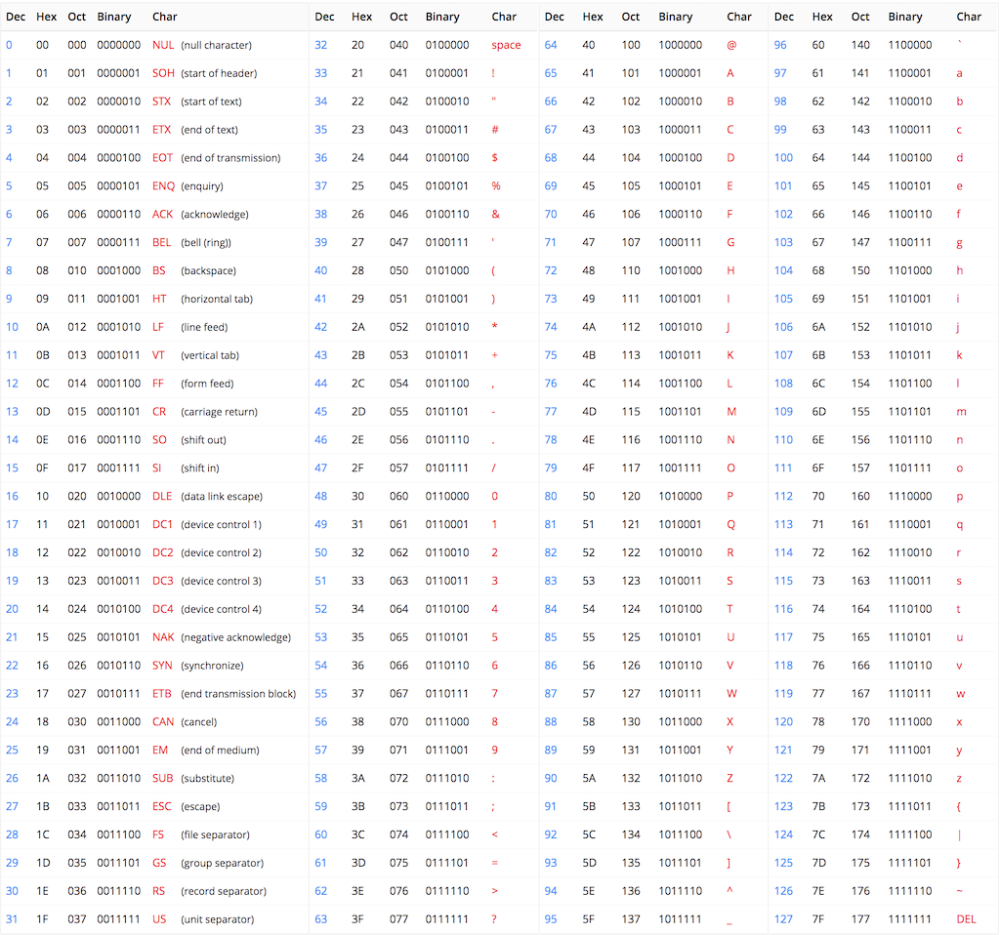

# 1. Storing and representing information in a computer

[TOC]

## 1.1. Storing information on a computer

Computer programs need to store and get access information on computer memories. But how exactly does that happen? What are the mechanisms behind data storage on a computer?

## 1.2. Storing Numbers

A computer is a calculator. But how exactly does it store numbers? Negative number? Real numbers?

## 1.3. Storing All Types of Information

On a computer, we can do a lot more than just calculations. Reading and writing texts, images, videos and audios. How does it work?

## 1.4. Data types

A data type is a convention by which we store numbers of a fixed range (for example 0-255) with a fixed amount of memory.

For example, if we take a sheet of paper with a row of squares as our memory, we can say that we'll only store numbers up to 99. This way, each number that we want to store can take 2 squares. Storing 17 and then 5 will look like:

1    7    0    5

In computer memories, only 0s and 1s can be stored. It was decided to group these binary digits into groups of 8; and different data types were invented:

- The byte data type is stored on 8-bits and can store an integral number from 0 to 255

- The unsigned short data type is stored on 16-bits and can store an integral number from 0 to 65535

- The unsigned int data type is stored on 32-bits and can store an integral number from 0 to 4 294 967 295

- The unsigned long long data type is stored on 64-bits and can store an integral number from 0 to 18 446 744 073 709 551 615

Remark: these data type names are depending on the compiler and language used. Different names exist, but the memory length of 8, 16, 32 and 64 bits are standard.

## 1.5. Numbers

Computer memories are based on physical and electrical principles that only allow to store two states. These states are represented by convention with 0 and 1. It is called a _binary state_.

Only one numeric system allows to count with two digits: the binary system.

- We need a way to encode these numbers in order to store and retrieve the correct information. Let's say our memory is a sheet of paper containing a row of squares, with each square being able to contain a digit (from 0 to 9). If we want to store the number 17 and then the number 5, we can write the following digits into our row of squares: 1, 7, 5. But then, if someone else comes and reads this "paper memory", how does he know we stored 17 and 5, and not 175? or 1 and 75? To answer these questions, we use **Data Types**.

- How to convert any number (integer, negative integer, fractional) into a form of binary representation (using only 0s and 1s)? This is the subject of **Number Encodings**.

### 1.5.1. Encoding positive integral numbers

Usually, we work with the decimal base to represent numbers, with digits from 0 to 9. The number 127 thus represents: $ 1 * 1^2 + 2 * 10^1 + 7 * 10^0 $.

In computer memories, we only have access to two states (0 and 1) so we must convert integral numbers to binary. To "understand" a binary number, we can use the same formula but on base two: 1101 in binary represents: $ 1 * 2^3 + 1 * 2^2 + 0 * 2^1 + 1 * 2^0 $.

Explain in more details how to convert between number bases: Number base conversions

### 1.5.2. Negative numbers

In mathematics, we are representing the negative numbers using the minus sign `-`. In computer hardware, there's no such thing. Only 0 and 1, so we needed to find a way to encode our negative numbers in binary form without using an extra symbol.

### 1.5.3. The Two's Complement Encoding

There are several ways to encode a negative number into binary, but the main technique that is used nowadays by processors is called two's complement.

Let's take a 4-bits chuck of memory as an example. In regular encoding, as seen above, this chunk can store numbers from 0 (0000 in binary) to 15 (1111 in binary). With 4 bits, we can only store 16 different values, so the idea with the two's complement method is to shift the values in order to represent numbers from -8 to 7 instead - so that we can represent negative numbers.

The two's complement method goes like this: for each strictly positive number, you can find it's negative counter-part by inverting all its bits and adding one. For example:

<table class="w3-table-all w3-hoverable">
	<tr class="w3-green">
		<td>Number (base 10)</td>
		<td>4-bits binary</td>
		<td>Negative (base 10)</td>
		<td>Two's complement</td>
	</tr>
	<tr class="w3-hover-green">
		<td>1</td>
		<td>0001</td>
		<td>-1</td>
		<td>1110 + 0001 = 1111</td>
	</tr>
	<tr class="w3-hover-green">
		<td>2</td>
		<td>0010</td>
		<td>-2</td>
		<td>1101 + 0001 = 1110</td>
	</tr>
	<tr class="w3-hover-green">
		<td>3</td>
		<td>0011</td>
		<td>-3</td>
		<td>1100 + 0001 = 1101</td>
	</tr>
	<tr class="w3-hover-green">
		<td>7</td>
		<td>0111</td>
		<td>-7</td>
		<td>0110 + 0001 = 0111</td>
	</tr>
</table>

This also works the other way around:

<table class="w3-table-all w3-hoverable">
	<tr class="w3-green">
		<td>Number (base 10)</td>
		<td>4-bits binary</td>
		<td>Negative (base 10)</td>
		<td>Two's complement</td>
	</tr>
	<tr class="w3-hover-green">
		<td>-1</td>
		<td>1111</td>
		<td>1</td>
		<td>0000 + 0001 = 0001</td>
	</tr>
	<tr class="w3-hover-green">
		<td>-2</td>
		<td>1110</td>
		<td>2</td>
		<td>0001 + 0001 = 0010</td>
	</tr>
	<tr class="w3-hover-green">
		<td>-3</td>
		<td>1101</td>
		<td>3</td>
		<td>0010 + 0001 = 0011</td>
	</tr>
	<tr class="w3-hover-green">
		<td>-7</td>
		<td>1001</td>
		<td>7</td>
		<td>0110 + 0001 = 0111</td>
	</tr>
</table>

There are two special cases, though: 0 and -8:

<table class="w3-table-all w3-hoverable">
	<tr class="w3-green">
		<td>Number (base 10)</td>
		<td>4-bits binary</td>
		<td>Two's complement</td>
	</tr>
	<tr class="w3-hover-green">
		<td>0</td>
		<td>0000</td>
		<td>0000</td>
	</tr>
	<tr class="w3-hover-green">
		<td>-8</td>
		<td>1000</td>
		<td>1000</td>
	</tr>
</table>

More formally, the two's complement b of a binary number a encoded using n bits is the binary number such that $ a + b = 2^n $ with n the number of bits that encodes a and b. Thus, $ b = 2^n - a $, and we can find our two special cases:

<table class="w3-table-all w3-hoverable">
	<tr class="w3-green">
		<td>4-bit number a</td>
		<td>Two's complement (base 10)</td>
		<td>Two's complement on 5-bits</td>
		<td>4-bit Two's complement</td>
	</tr>
	<tr class="w3-hover-green">
		<td>0000</td>
		<td>16 - 0 = 16</td>
		<td>10000 - 00000 = 10000</td>
		<td>0000</td>
	</tr>
	<tr class="w3-hover-green">
		<td>1000</td>
		<td>16 - 8 = 8</td>
		<td>10000 - 01000 = 01000</td>
		<td>1000</td>
	</tr>
</table>

As you can see, overflowing bits are thrown away (the fifth bit cannot be stored as we are using 4 bits to stored our numbers).

### 1.5.4. Why two's complement ?

### 1.5.5. The Reason behind Two's Complement Representation

Why are we using such a complicated formula? Because the goal of computers is to compute (perform operations on numbers) and this representation helps our electronic components handle the data. For example, using the two's complement reprsentation it is straightforward to add two numbers. The addition rule is the same as with positive numbers (adding bits one by one with the carry):

<table class="w3-table-all w3-hoverable">
	<tr class="w3-green">
		<td>Decimal addition</td>
		<td>Binary addition</td>
		<td>Binary result</td>
		<td>Decimal result</td>
	</tr>
	<tr class="w3-hover-green">
		<td>6 + (-4)</td>
		<td>0110 + 1100</td>
		<td>(1)0010</td>
		<td>2</td>
	</tr>
</table>

The second advantage of this representation is we can easily implement subtraction: to perform \(a - b\), we only need to transform b into its two's complement representation and then add the two numbers \(a + (-b)\).

### 1.5.6. Fractional numbers

Until now, we saw how to store integer numbers. But how to store fractional numbers, such as 2.34? We need a different encoding for these numbers: the floating-point format. We are usually representing fractional numbers in two sizes: 32 bits (`float` type in C) and 64 bits (`double` type in C).

Recall how to construct a decimal number using powers of tens. For fractional numbers, it is the same, but with negative powers of tens after the comma: the number 12.345 can be written:

$$ 12.345 = 1 * 10^1 + 2 * 10^0 + 3 * 10^{-1} + 4 * 10^{-2} + 5 * 10^{-3} $$

We can use the same approach to represent a binary number:

$$ 1100.101_2 = 1 * 2^3 + 1 * 2^2 + 0 * 2^1 + 0 * 2^0 + 1 * 2^{-1} + 0 * 2^{-2} + 1 * 2^{-3} $$

The idea behind encoding floating point numbers is like representing the numbers in scientific notation. Scientific notation, in decimal, is the representation of any number in the form

$$ number = y.xxx * 10^e $$

for example: $ 1 345 673.12 = 1.34567312 * 10^6 $

Thus the binary number scientific notation would be:

$$ number_2 = 1.xxx * 2^e $$

for example: $ 1100.101_2 = 1.100101_2 * 2^{11_2} $

This is what is used to encode fractional binary numbers: $ 1.[fraction] * 2^{[exponent]} $.

### 1.5.7. Single Precision Numbers

On 32 bits, we divid the bits with 1 sign bit s, 8 exponent bits e and the remaining 23 bits for the fractional part:

The formula for decoding a 32-bit floating point number is as follows:

$$ n_{10} = (-1)^s * 2^e * \left( 1 + \sum_i b_{23-i} * 2^{-i} \right) $$

where $ n_{10} $ is the resulting decimal number, s is the sign bit (most significant bit), e is the decimal value corresponding to the 8 exponent bits and $ b_i $ are the bits number $ i $.

#### 1.5.7.1. Sign bit

The most significant bit (bit 31) is the sign bit. `0` means we encoded a positive number, and `1` is negative.

#### 1.5.7.2. Exponent encoding

The exponent e is not encoded using the two's complement representation, but with a different one: the offset-binary representation with the zero offset being 127. This means that $0000,0000_2$ represents $-126$, $1000,0000_2$ represents $0$ and $1111,1111_2$ represents $127$.

#### 1.5.7.3. Fraction encoding

The fractional part of the number is encoded with standard binary encoding. There is a simple method to convert a decimal fractional part into binary:

* multiply by two 
* take the integer part (either 0 or 1) which will be the binary bit number -1 (bit number 22 in our 32-bit floating-point encoding) 
* multiply the fractional part of the number obtained by 2 
* repeat for bit number -2 ... -22 (bits 21 to 0 in 32-bit floating-point encoding)

For example, for 0.345:

<table class="w3-table-all w3-hoverable">
	<thead>
		<tr class="w3-green">
			<th>Multiply by 2</th>
			<th>Integer part</th>
			<th>Fraction part</th>
			<th>Bit number in 32-bit representation</th>
		</tr>
	</thead>
	<tr class="w3-hover-green"><td>0.345 * 2 = 0.690</td>	<td>0</td>	<td>0.690</td>	<td>22</td></tr>
	<tr class="w3-hover-green"><td>0.690 * 2 = 1.380</td>	<td>1</td>	<td>0.380</td>	<td>21</td></tr>
	<tr class="w3-hover-green"><td>0.380 * 2 = 0.760</td>	<td>0</td>	<td>0.760</td>	<td>20</td></tr>
	<tr class="w3-hover-green"><td>0.760 * 2 = 1.520</td>	<td>1</td>	<td>0.520</td>	<td>19</td></tr>
	<tr class="w3-hover-green"><td>0.520 * 2 = 1.040</td>	<td>1</td>	<td>0.040</td>	<td>18</td></tr>
	<tr class="w3-hover-green"><td>0.040 * 2 = 0.080</td>	<td>0</td>	<td>0.080</td>	<td>17</td></tr>
	<tr class="w3-hover-green"><td>..</td>	<td>..</td>	<td>..</td>	<td>..</td></tr>
	<tr class="w3-hover-green"><td>0.880 * 2 = 1.760</td>	<td>1</td>	<td>0.760</td>	<td>0</td></tr>
</table>

#### 1.5.7.4. Range and Precision

The fractional part is stored with 23 bits. This allows a precision of between 7 and 9 significant digits ( $2^{23} = 8,388,608$). The exponent is stored on 8 bits, which allows numbers from $2^{-126} \approx 1.175 * 10^{-38}$ to $2^{127} \approx 1.701 * 10^{38}$.

### 1.5.8. Double-precision numbers

The `double` data type, as for double precision floating-point, is a data type encoded on 64 bits: 1 sign bit, 11 exponent bits and 52 fractional bits.

#### 1.5.8.1. Range and Precision

The 52 bits of the fractional part allows between 14 and 16 significant digits ($2^{52} \approx 4.5 * 10^{15}$). The exponent is stored on 11 bits, which allows numbers from $2^{-1023} \approx 1.11 * 10^{308}$ to $2^{1024} \approx 1.8 * 10^{308}$ although sometimes these two bounds are reserved for special purposes.

## 1.6. Storing characters

In a computer, we often need to store text, so we need a way to store characters.

Characters are stored using a convention that we define in advance, saying how to convert a character into a storable data.

In computers, data can only be stored as numbers. So these conventions are telling the computer (or the program that reads the memory of the computer) how to convert numbers into characters. The conventions are called encodings.

There exists different encodings. The most common ones include:

- ASCII: American Standard Code for Information Interchange, the most basic encoding for the English language.

- UTF: Unicode Transformation Format. How do we handle other languages?

### 1.6.1. ASCII

_American Standard Code for Information Interchange_

The first encoding that came to the mind of computer scientists was the following: decide for a corresponding number to each letter.

The English alphabet is composed of 26 letters, that are declined into lowercase and uppercase letters; which makes 52 different symbols. If we can add to this the 10 digits plus different symbols, such as $ or punctuation symbols, we reach 127 characters.

Knowing that the bigger the number, the more space it takes in a computer memory; they wanted to limit the space taken by each character in memory so they decided that this encoding was sufficient to encode English texts. Each symbol corresponds to a single number, as shown below

### 1.6.2. UTF

_Unicode Transformation Format_

The ASCII encoding is great for the English language, but what about other languages with different symbols and alphabets, such as French, Spanish or any other language with special characters such as accents and other symbols? We need another convention that can also store these different characters.

The first way to solve this problem is to extend the transformation table to these other characters: the Extended ASCII.

The Unicode encoding is a bit more than a conversion between characters and numbers: it defines the conversion between characters and code points, that are then translated into storable numbers using different techniques, called UTF-8, UTF-16 and UTF-32 (amongst others). It defines 1112064 code points corresponding to the different characters existing in the different languages on this planet.

### 1.6.3. UTF-32

Storing characters with large numbers.

The ASCII encoding is using numbers from 0 to 127 to store the English alphabet and letters. As explained in Storing Numbers, these numbers are stored using a fixed amount of memory, that is called a byte (taking 8-bits of memory space); and is limited to numbers below 256.

In order to extend the alphabet to other symbols, we need to convert these symbols to numbers that are higher than 256. The UTF-32 encoding uses numbers up to 4294967296 (that is a lot!) in a number format that takes 32-bits of memory space.

#### 1.6.3.1. Advantages

The advantages of this encoding is that it is retro-compatible with ASCII: the first 127 characters are equivalent in both encodings.

#### 1.6.3.2. Drawbacks

The drawbacks is that if you store mostly English alphabet's characters, you are loosing memory space because each number will take the same amount of space in this encoding, whatever its value (which will be 32 bits of memory space for each character, as compared to just 8-bits for ASCII encoding characters).

### 1.6.4. UTF-8

How to reduce the memory footprint for texts with mostly simple characters?

To overcome the problems of memory space explained in UTF-32, the UTF-8 encoding has been invented.

The UTF-8 is a variable bit-length format that takes at minimum 1 byte of memory for each character, but can go up to 4 bytes of memory for a single character (see Storing Numbers).

The principle behind the encoding uses the fact that ASCII only uses 7 bits to store its characters (up to number 127), so we can use the remaining bit to say if we are storing ASCII (last bit is 0) or if we are using more bytes to store an extra character (last bit is 1). In the latter case, we'll set each following bits to 1 to indicate the length of our character in bytes and the next bit will be set to 0 as a separator. For example, if we see the first byte of UTF-8 encoded string that is 110x xxxx it means that it is a character that is encoded in two bytes. Here is a table that summarizes the possible scenarios for UTF-8 encoded characters:

<table class="w3-table-all w3-hoverable">
	<tr class="w3-green">
		<td>Number of bytes</td>
		<td>Byte 1</td>
		<td>Byte 2</td>
		<td>Byte 3</td>
		<td>Byte 4</td>
	</tr>
	<tr class="w3-hover-green">
		<td>1</td>
		<td>0xxxxxxx</td>
		<td></td>
		<td></td>
		<td></td>
	</tr>
	<tr class="w3-hover-green">
		<td>2</td>
		<td>110xxxxx</td>
		<td>10xxxxxx</td>
		<td></td>
		<td></td>
	</tr>
	<tr class="w3-hover-green">
		<td>3</td>
		<td>1110xxxx</td>
		<td>10xxxxxx</td>
		<td>10xxxxxx</td>
		<td></td>
	</tr>
	<tr class="w3-hover-green">
		<td>4</td>
		<td>11110xxx</td>
		<td>10xxxxxx</td>
		<td>10xxxxxx</td>
		<td>10xxxxxx</td>
	</tr>
</table>

By using a variable length enconding like this one, we are saving space on the memory. This encoding is one of the most used encoding for storing strings of characters in programs and websites.

### 1.6.5. UTF-16

A trade-off between the two previous ones.

UTF-16 is another variable length format, that follows the same principle that UTF-8. The difference is that its base unit is coded on 16 bits instead of 8, meaning each character is taking at least 16 bits of memory. Characters are either 16 bits or 32 bits.

## 1.7. Storing images

How to store graphical contents, such as images or videos, on a computer memory?

Following the same principle explained in [Storing Characters](Storing%20Characters.html), images are stored in the memory using a convention that we define in advanced, saying how to convert an image into storable information. This convention is called a format or sometimes an encoding, like for numbers. The process to convert an image into a set of storable data is called digitization.

### 1.7.1. Basic principle

An image is usually a rectangle filled with different colors. As we saw in the description of [computer memories](Computer%20Memories.html), the memory of a computer can only store strings of data (uni-dimensional array of bits -- or numbers). 
We need to find a way to transform a rectangle filled with colors into a string of numbers. 

#### 1.7.1.1. "Pixelization" -- Rasterization

The first step is to divide the image into a combination of small discrete regions. If we make the regions small enough, we can fool our eyes into believing the content is continuous. 

<table width="100%" class="w3-center">
	<tr><th>
		
	</th></tr>
	<tr><td class="w3-text-gray">Image digitalization.</td></tr>
</table>

#### 1.7.1.2. Metadata

To store each region -- called pixel -- into the memory, which is linear, we can define in a convention, that we'll store all the rows of the digitalized image rectangle one after the other in the memory. But this is not enough, we also need to know the row lengths in order to reconstruct the image from the memory. We also need to know the total length of the image (number of pixels) so that we know when to stop reading the memory to reconstruct the image. To do this, we could for example store the length of a row (width of the image) at first, then the total size of the image, and then all the rows one after the other. 

<table width="100%" class="w3-center">
	<tr><th>
		
	</th></tr>
	<tr><td class="w3-text-gray">Image saved into memory with simple format.</td></tr>
</table>

In practice, how we store these extra information is defined in the image format. It is part of a header section that contains metadata (extra information that is not part of the raw data of the image itself) and many more information could be present depending on the format. Some formats even allow adding custom metadata into the image file directly.

### 1.7.2. Storing colors into the memory

Scientists remarked that we can make almost all visible colors by mixing only three base colors: red, green and blue. 
Based on this, we can transform the colors of each pixel into a percentage of mixing for the red color, a percentage of mixing for the green color and a percentage of mixing for the blue color. 
These are three numbers that completely define the pixel's color.

Let's take an example. For a pixel that is totally blue, the memory will look like (in numerical representation):

[ 0 ] [ 0 ] [ 100 ]

This is because for a pixel that is totally blue, we do not mix any red nor green. Yellow is the combination of red and green. Thus for a yellow pixel, we'd have:

[ 100 ] [ 100 ] [ 0 ]

#### 1.7.2.1. Improving the range of colors

These percentages could be stored as integers from 0 to 100. However, to take advantage of the physical memories properties, they are usually stored using a different transformation depending on the underlying encoding we are using.

The simplest encoding uses the 8-bits data type to store each percentage, so that 0 corresponds to 0% and its maximum value (255) corresponds to 100%. Other formats exist, for example with 16-bits data types resulting in a increased color range available: from 0 to 65535.