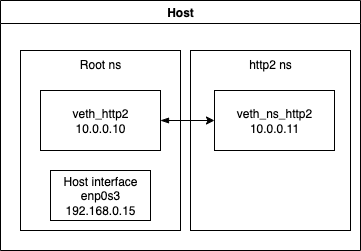

This article summarizes networking concepts of containers using `iptables`.

[TOC]

# 1. Container networking

Sources: [Dustin Specker's excellent posts on the subject](https://dustinspecker.com/posts/ipvs-how-kubernetes-services-direct-traffic-to-pods/)

Containers are packaged applications that are isolated form each other and form the host operating system using different isolation and control mechanisms. Here are the main ones:

- `namespaces` (a feature of the Linux kernel) allows the isolation of most of the dependencies, such as the networking, processes and users
- `cgroups` (another feature of the Linux kernel) allows the monitoring and control of the resources used by processes (CPU, memory, etc.)
- read-only filesystems, copy-on-write filesystems and bind mounts are used to isolate filesystems between each running container and the host filesystem

To handle networking concerns between containers and from containers to host, container runtimes use **network namespaces**.

## 1.1. Network namespaces

### 1.1.1. Create a network namespace

In Linux, here are the commands to create a network namespace and launch a simple HTTP server in this namespace (on port 8080):

```bash
sudo ipnetns add http2
sudo ip netns exec http2 pythohn3 -m http.server 8080
```

To link two namespaces, such as the root namespace (host's one) and the new one:

```bash
# Create a virtual ethernet interface pair
sudo ip link add dev veth_http2 type veth peer name veth_ns_http2
# Move second veth into namespace
sudo ip link set veth_ns_http2 netns http2
# Enable interfaces
sudo ip link set dev veth_http2 up
sudo ip netns exec http2 ip link set dev veth_ns_http2 up
# Add IP addresses to both interfaces
sudo ip address add 10.0.0.10/24 dev veth_http2
sudo ip netns exec http2 ip address add 10.0.0.11/24 dev veth_ns_http2
```

_Note_: by default, the loopback device is not enabled on new namespaces. To enable it: `sudo ip netns exec http2 ip link set dev lo up`.

Here is a summary of the current setup:




### 1.1.2. Routing between namespaces

In this state, packets are routed between the two veth interfaces, but they are not routing on the hosts's root network namespace. To correct it:

```bash
# Route all external traffic via 10.0.0.10
sudo ip netns exec http2 ip route add default via 10.0.0.10
# Enable ip forwarding in Linux's kernel
echo 1 | sudo tee /proc/sys/net/ipv4/ip_forward
# Forward both outgoing and incoming packets
sudo iptables --append FORWARD --in-interface veth_http2 --out-interface enp0s3 --jump ACCEPT
sudo iptables --append FORWARD --in-interface enp0s3 --out-interface veth_http2 --jump ACCEPT
# Enable NAT
sudo iptables --append POSTROUTING --table nat --out-interface enp0s3 --jump MASQUERADE
# Set default DNS on http2 ns
sudo mkdir -p /etc/netns/http2
echo "nameserver 8.8.8.8 | sudo tee /etc/netns/http2/resolv.conf"
```

### 1.1.3. Briding networks

We can bridge different interfaces that are in the different namespaces so that we can create a VLAN shared between all namespaces. The following snippet assume you have created a new network namespace `http3` as in previous section.

```bash
# Add bridge virtual interface
sudo ip link add dev bridge_local type bridge
# Set IP and range
sudo ip address add 10.0.0.1/24 dev bridge_local
# Enable interface
sudo ip link set bridge_local up
# Add virtual ethernet http2 to bridged network
sudo ip link set dev veth_http2 master bridge_local
# Add another virtual ethernet http3 to bridged network
sudo ip link set dev veth_htt3 master bridge_local
# Enable routing through bridge
sudo ip netns http2 ip route add default via 10.0.0.1
sudo ip netns http3 ip route add default via 10.0.0.1
# Enable forwarding of packets between virtual ethernets of the bridge
sudo iptables --append FORWARD --in-interface bridge_local --jump ACCEPT
sudo iptables --append FORWARD --out-interface bridge_local --jump ACCEPT
# Add NAT
sudo iptables --table nat --append POSTROUTING --source 10.0.0.0/24 --jump MASQUERADE
```

This creates a VLAN between http2 and http3 namesapces in the range 10.0.0.0/24 and enables the NAT to reach internet from host's interface.

_Note_: iptables rules from previous section can be deleted.