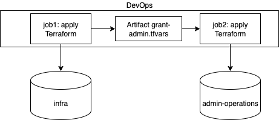

This article explains one way of building a safe CI/CD pipeline to apply the "Admin Consent" on AzureAD AppRegistrations created by Terraform.

[TOC]

# 1. Context

Azure AD uses [AppRegistration](https://learn.microsoft.com/en-us/entra/identity-platform/quickstart-register-app) objects to represent the identity of a web application. This object is used to configure the security related settings of the application, such as authentication and authorization.

In the _Expose an API_ settings of this Azure AD object, it is possible to declare scopes allowing to authorize a client application to call the API (usually through its access_token scope). Some of these scopes can require the "Admin Consent" for higher-priviledged operations, as an extra security measure.

To authorize a client application to access a web API, you need to [configure the app permissions](https://learn.microsoft.com/en-us/entra/identity-platform/quickstart-configure-app-access-web-apis) in the client AppRegistration settings. After this step, if the scope declared in the web API requires admin consent, you need to have an admin account (with Global Administrator role) in order to grant the consent on behalf of all users (so they're not prompted to do so). This is especially the case for external APIs, such as Microsoft Graph API.

# 2. Use case and process workflow

Here is a simple use case to demonstrate the need of a grant admin workflow.

We are developing two web APIs, `api-a` and `api-b`. Each of these web APIs are assigned an AppRegistration on Azure AD Portal to manage their security related features (respectively `AppReg A` and `AppReg B`). 

<div class="w3-center">

</div>

## 2.1. Why do we need a safe admin consent workflow

`api-a` needs to call `api-b`, so we need to expose an API on `AppReg B` and authorize `api-a` to access this exposed API using its access_token. Now, imagine that `api-b` exposes an API that can perform dangerous operations : you want to restrict calling applications such that an administrator approves the authorization requests from calling apps. This can be done by setting the "Who can consent" to "Admins only" on Azure Portal.

Another use case : your `api-a` needs to access a resource of the Microsoft Graph API. In this case, the admin consent can be enabled by default on some scopes.

Terraform can create the AppRegistrations of `api-a` and `api-b`, and set the correct permissions.

It can also apply the admin consent for us, but for this to work, it needs a high-priviledged service principal with the `Directory.ReadWrite.All` role (or your need the `Global Administrator` role if connected with a user principal), see [Terraform Registry Documentation](https://registry.terraform.io/providers/hashicorp/azuread/latest/docs/resources/service_principal_delegated_permission_grant). This is a high-level role that needs care before being assigned to any service principal, because of security reasons.

## 2.2. The Grant Admin Terraform configuration and workflow

In order to avoid using a highly priviledge service principal to perform "standard" Terraform operations (such as creating and configuration the AppRegistrations), we need to separate the two sets of operations:

- Perform "standard" Terraform operations using a service principal `sp1`
- Perform the Admin Consent grant operation using a high priviledge service principal `sp2` 
- Protect the grant operation using Terraform built-in validators and a whitelist of access rights, as well as git RBAC

Here is the proposed configuration using two git repositories:

- `infra`: stores Terraform configuration for creating the infrastructure. To be used with a standard service principal.
- `admin-operations`: stores a protected Terraform configuration for applying the admin consent. Used with a high-privileged service principal. This repository must be configured so that a write modification must be reviewed by an Administrator of the system/infrastructure.

Then, the CI pipeline will be divded into two separate processes:

- `job1` will init/plan/apply the Terraform configuration from the `infra` repository using `sp1`
- `job1` will then export all necessary information regarding admin consents required
- `job2` will ini/plan/apply the Terraform configuration from the `admin-operations` repository using `sp2` and the output from `job1`

<div class="w3-center">

</div>

# 3. Terraform configurations

## 3.1. Grant admin reusable configuration in Admin-Operations

Let's write a reusable Terraform configuration that performs the grant admin for the list of permissions passed as arguments. First, let's see how we can grant the admin consent for a permission between `AppReg A` and `AppReg B`. 

- If the permission is an application permission (usually, used for backend-to-backend communication without user authentication), we can use the app role assignment resource:

```hcl
resource "azuread_app_role_assignment" "ac_application" {
    app_role_id         = "..." # Object id of the role in destination
                                # (app_role.id declared in azuread_application)
    principal_object_id = "..." # Object id of the source
    resource_object_id  = "..." # Object id of the destination
}
```

- If the permission is a delegated permission (access is granted on behalf of a user), we use a delegated permission grant resource:

```hcl
resource "azuread_service_principal_delegated_permission_grant" "ac_delegated" {
    service_principal_object_id             = ""    # SP of the source
    resource_service_principal_object_id    = ""    # SP of the destination
    claim_values                            = ["openid", "User.Read.All"]
}
```

To make a reusable configuration, we can add two arrays of objects representing the list of permissions (application and delegated) to be granted. Then, we have to loop through these lists to grant all permissions. 

> Note: the list of objects cannot be directly passed to `for_each` in Terraform as the `for_each` requires a map, but we can transform the list into a map using a `for`.

```hcl
variable "application_permissions" {
    type = list(object({
        src_sp_id   = string
        dest_id     = string
        role_id     = string
    }))
}

variable "delegated_permissions" {
    type = list(object({
        src_sp_id   = string
        dest_sp_id  = string
        claims      = list(string)
    }))
}

resource "azuread_app_role_assignment" "ac_application" {
    for_each = {
        for index, obj in var.application_permissions:
        index => obj
    }
    app_role_id         = each.value.role_id
    principal_object_id = each.value.src_sp_id
    resource_object_id  = each.value.dest_id
}

resource "azuread_service_principal_delegated_permission_grant" "ac_delegated" {
    for_each = {
        for index, obj in var.delegated_permissions:
        index => obj
    }
    service_principal_object_id             = each.value.src_sp_id
    resource_service_principal_object_id    = each.value.dest_sp_id
    claim_values                            = each.value.claims
}
```

With this simple configuration, we now have a reusable way of setting grant admins listed in a `.tfvars` file that we pass to the `terraform plan` command line:

```bash
terraform plan -var-file="grant-admin-consents.tfvars"
```

## 3.2. Infra

## 3.3. Passing information from one configuration to the other

## 3.4. Security

### 3.4.1. Adding validations to terraform inputs

### 3.4.2. Filtering on allowed roles

### 3.4.3. RBAC and Azure DevOps security


